The knowledge graph represents a collection of interlinked descriptions of entities - objects, events or concepts.
Knowledge graphs put data in context via linking and semantic metadata and this way provide a framework for data
integration, unification, analytics and sharing.

<!--truncate-->

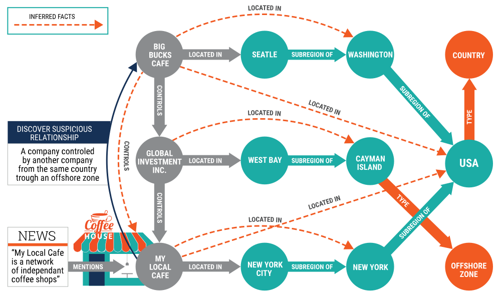

The knowledge graph (KG) represents a collection of interlinked descriptions of entities - real-world objects and
events, or abstract concepts (e.g., documents) – where:

- Descriptions have formal semantics that allow **both people and computers** to process them in an efficient and
  unambiguous manner;
- Entity descriptions contribute to one another, forming a network, where each entity represents part of the description
  of the entities, related to it, and provides context for their interpretation.

Key Characteristics
-------------------

Knowledge graphs combine characteristics of several data management paradigms:

- **Database**, because the data can be explored via structured queries;
- **Graph**, because they can be analyzed as any other network data structure;
- **Knowledge base**, because they bear formal semantics, which can be used to interpret the data and infer new facts.

Knowledge graphs, represented in [RDF](#what-is-rdf), provide the best framework for data integration, unification,
linking and reuse, because they combine:

- **Expressivity** The standards in the Semantic Web stack - RDF(S) and OWL - allow for a fluent representation of
  various types of data and content: data schema, taxonomies and vocabularies, all sorts of metadata, reference and
  master data. The RDF* extension makes it easy to model provenance and other structured metadata.
- **Performance** All the specifications have been thought out, and proven in practice, to allow for efficient
  management of graphs of  billions of facts and properties.
- **Interoperability** There is a range of specifications for data serialization, access (SPARQL Protocol for
  end-points), management (SPARQL Graph Store) and federation. The use of globally unique identifiers facilitates data
  integration and publishing.
- **Standardization** All the above is standardized through the W3C community process, to make sure that the
  requirements of different actors are satisfied – all the way from logicians to enterprise data management
  professionals and system operations teams.

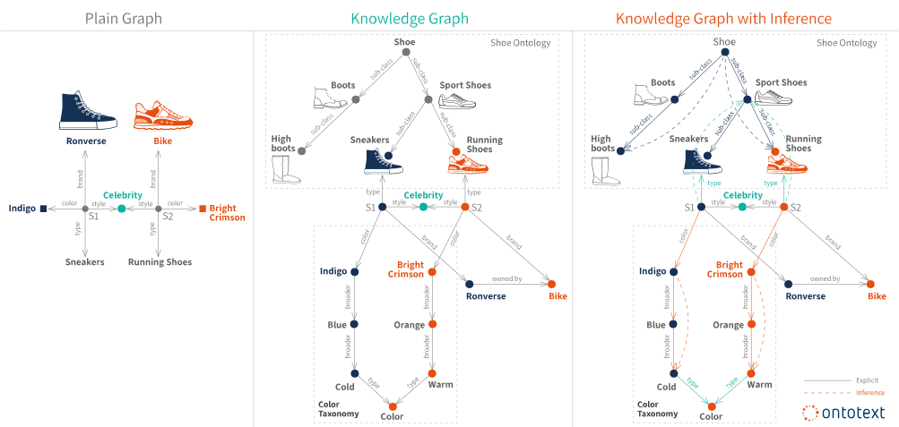

Ontologies and Formal Semantics
-------------------------------

**[Ontologies](#what-are-ontologies)** represent the backbone of the formal semantics of a knowledge graph. They can be
seen as the data schema of the graph. They serve as a formal contract between the developers of the knowledge graph and
its users regarding the meaning of the data in it. A user could be another human being or a software application that
wants to interpret the data in a reliable and precise way. Ontologies ensure a shared understanding of the data and its
meanings.

When formal semantics are used to express and interpret the data of a knowledge graph, there are a number of
representation and modeling instruments:

- **Classes** Most often an entity description contains a classification of the entity with respect to a class
  hierarchy. For instance, when dealing with business information there could be classes _Person_, _Organization_ and
  _Location_. Persons and organizations can have a common superclass _Agent_. Location usually has numerous sub-classes,
  e.g., _Country_, _Populated place_, _City_, etc. The notion of class is borrowed by the object-oriented design, where
  each entity usually belongs to exactly one class.
- **Relationship Types** The relationships between entities are usually tagged with types, which provide information
  about the nature of the relationship, e.g., _friend_, _relative_, _competitor_, etc. Relationship types can also have
  formal definitions, e.g., that _parent-of_ is inverse relation of _child-of_, they both are special cases of
  _relative-of_, which is a symmetric relationship. Or defining that sub-region and subsidiary are transitive
  relationships.
- **Categories** An entity can be associated with categories, which describe some aspect of its semantics, e.g.,
  "_Big four consultants_" or "_XIX century composers_". A book can belong simultaneously to all these categories:
  "_Books about Africa_", "_Bestseller_", "_Books by Italian authors_", "_Books for kids_", etc. The categories are
  described and ordered into taxonomy.
- **Free Text Descriptions** Often a 'human-friendly text' description is provided to further clarify design intentions
  for the entity and improve search.

What is NOT a Knowledge Graph
-----------------------------

### Not Every RDF Graph is a Knowledge Graph

For instance, a set of statistical data, e.g. the GDP data for countries, represented in RDF is not a KG. A graph
representation of data is often useful, but it might be unnecessary to capture the semantic knowledge of the data. It
might be sufficient for an application to just have a string "Italy" associated with the string "GDP" and a number
'1.95 trillion' without needing to define what countries are or what the 'Gross Domestic Product' of a country is.
_**It's the connections and the graph that make the KG, not the language used to represent the data**_.

### Not Every Knowledge Base is a Knowledge Graph

A key feature of a KG is that **entity descriptions should be interlinked to one another**. The definition of one entity
includes another entity. This linking is how the graph forms. (e.g. A is B. B is C. C has D. A has D). Knowledge bases
without formal structure and semantics, e.g. Q&A "knowledge base" about a software product, also do not represent a KG.
It is possible to have an expert system that has a collection of data organized in a format that is not a graph but uses
automated deductive processes such as a set of 'if-then' rules to facilitate analysis.

Examples of Big Knowledge Graphs
--------------------------------

### Google Knowledge Graph

Google made this term popular with the announcement of its knowledge graph in 2012. However, there are very few
technical details about its organization, coverage and size. There are also very limited means for using this knowledge
graph outside Google's own projects.

### [DBPedia](https://www.dbpedia.org/)

[This project](https://www.dbpedia.org/) leverages the structure inherent in the infoboxes of Wikipedia to create an
enormous [dataset of 4.58 things](https://wiki.dbpedia.org/about) and an ontology that has encyclopedic coverage of
entities such as people, places, films, books, organizations, species, diseases, etc. This dataset is at the heart of
the Open Linked Data movement. It has been invaluable for organizations to bootstrap their internal knowledge graphs
with millions of crowdsourced entities.

### [Geonames](https://www.geonames.org/)

Under a creative commons, users of [Geonames](https://www.geonames.org/) dataset have access to 25 million geographical
entities and features.

### [Wordnet](https://wordnet.princeton.edu/)

One of the most well-known lexical databases for the English language, providing definitions and synonyms. Often used to
enhance the performance of NLP and search applications.

The Most Common Graph Query Languages
-------------------------------------

- **Gremlin** A graph searching language originally developed for the Apache Tinkerpop project that allows procedural or
  declarative queries.
- **Cypher** First created by Neo4j and later adopted by others as OpenCypher, this declarative language allows
  searching for nodes and edges that match particular properties.
- **GQL** This proposed standard attempts to unify the styles of Cypher, GSQL, and PSQL.
- **SPARQL** A standard developed for querying knowledge graphs stored in the RDF format.
- **PGQL** Oracle's original language for searching and collecting information from nodes that match specifications.
- **GSQL** TigerGraph's original procedural language.
- **AQL** ArangoDB’s original procedural language.

Reference
---------

### What is RDF

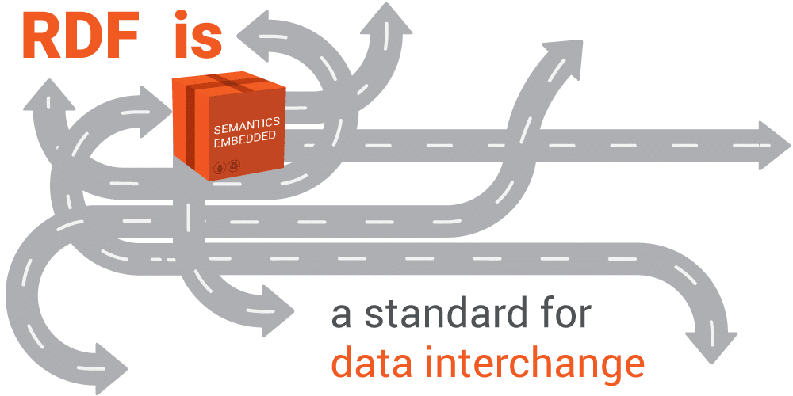

RDF stands for Resource Description Framework and is a standard for describing web resources and data interchange,
[developed and standardized with the World Wide Web Consortium (W3C)](https://www.w3.org/TR/rdf11-concepts/). While
there are many conventional tools for dealing with data and more specifically for dealing with the relationships between
data, RDF is the easiest, most powerful and expressive standard designed by now.

:::info

RDF is a general method of describing data by defining relationships between data objects.

:::

#### The RDF Triples

The way RDF connects data pieces together is via triples (three positional statements).

In plain English, an RDF statement states facts, relationships and data by linking resources of different kinds. With
the help of an RDF statement, just about anything can be expressed by a uniform structure, consisting of three linked
data pieces.


Let's consider the following statement: "Apoptosis is a type I programmed cell death". Translated into RDF statements
according to the semantic repository shown below, the example fact (statement) would state the information in the
following way: "Apoptosis is a type I programmed cell death" = > "Apoptosis of neutrophils" is the subject in two
separate statements:

1. `<apoptosis>` is_a `<type 1 programmed cell death>` and
2. `<apoptosis>` type `<biological process>`

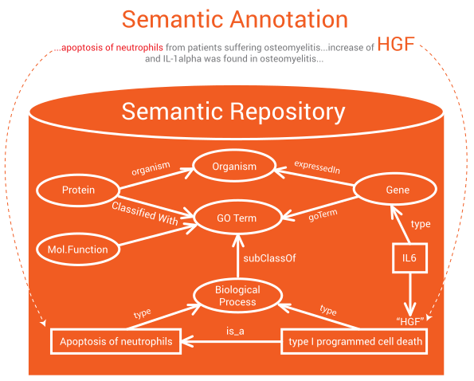

#### The RDF Knowledge Graph

Being a powerful and expressive framework for representing data, RDF is used for building knowledge graphs. The
following diagram demonstrates the expressivity of RDF.

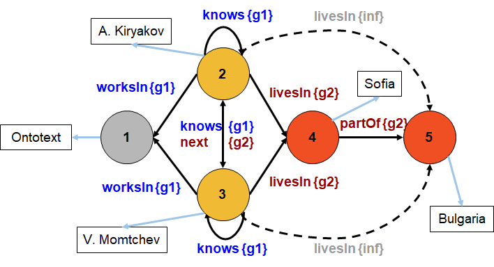

The nodes in an RDF knowledge graph could be either resources, represented by a unique resource identifier (URI, e.g.,
the well known URLs), literals (e.g., the same as in XML) or auxiliary blank nodes. The types of the edges are called
predicates, (e.g., partOf or knows). Named graphs or contexts (e.g., g1 and g2 above) can be used to manage components
in the graph, (e.g., by provenance). Each edge in the graph represents a fact and can be seen as a quadruple
`<subject, predicate, object, context>`.

Classes, predicates and named graphs are all defined as URIs. This way they can appear as nodes in the graph, get their
descriptions, i.e. instance data and schema can be managed and accessed in an uniform model. The nodes in the above
diagram are numbered for better readability

Often RDF is criticized because it doesn't allow for descriptions or properties to be attached to the edges in the graph
and this is perceived as a disadvantage compared to Property Graphs. This concern has been addressed with
[RDF-Star](#what-is-rdf-star) (abbreviated RDF*)

#### What is an RDF Triplestore

> The RDF triplestore is a type of graph database that stores data as a network of objects and uses inference to uncover
> new information out of existing relations. It's flexible and dynamic nature allows linking diverse data, indexing it
> for semantic search and enriching it via text analysis to build big knowledge graphs.

### What is RDF-Star

> RDF-Star (also known as “RDF*”) allows descriptions to be added to edges in a graph such as scores, weights, temporal
> aspects and provenance to edges in a graph. Formally, RDF* extends the RDF graph model by allowing statements about
> statements, i.e., one can attach metadata, which describe an edge in a graph, while RDF allows statements to be made
> only about nodes.

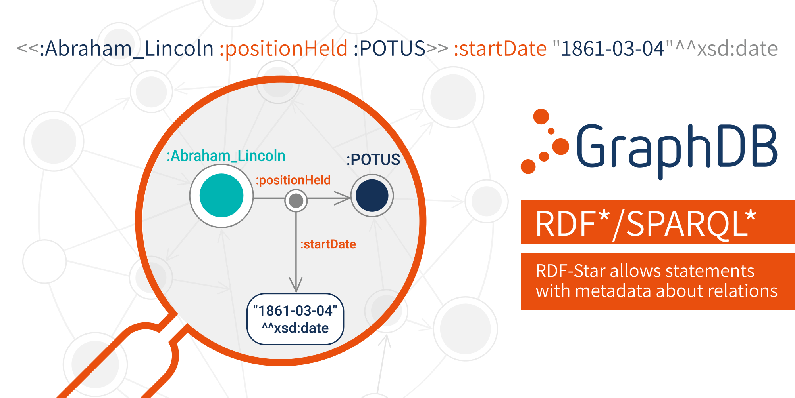

RDF-star (or RDF*) and the associated query language SPARQL-star (also written as SPARQL*) are the most widely supported
extension of the existing standards and will be included in RDF 1.2. In RDF* one can make statements about statements,
formally called statement-level annotations. For instance, one can provide a time span for a relationship. The example
above demonstrates that Abraham Lincoln was the President of the United States (i.e. POTUS) from March 4th 1862.

RDF* goes beyond the expressivity of Property Graphs, where one can attach key-value pairs to relationships. The
statement-level annotations enable a more efficient representation of scores, weights, temporal restrictions and
provenance information.

#### Why is RDF not Enough

[RDF](#what-is-rdf) stands for Resource Description Framework and is a standard for data interchange on the Web,
developed via a W3C community process. Conceived as the foundation of the entire stack of Semantic Web standards, it has
features that allow it to link data published without centralized control. An expressive and powerful language, it
enables us to deliver enterprise-strength knowledge graphs to solve the data management problems of some of the world's
top global brands in finance, pharmaceuticals and media.

RDF (without the star) is an abstract knowledge representation model that does not differentiate data from metadata. It
provides enormous flexibility for the expression of multiple levels of metadata about nodes, classes, predicates
(relationship types) and even (sub-)graphs. It is all about making statements about nodes. Nodes and predicates are
identified via URIs (Uniform Resource Identifiers, e.g., URLs). Here follows an example:

```bash
    :hasSpouse rdf:type owl:TransitiveProperty;
            rdfs:subPropertyOf :familyRelationship .
    :Person rdfs:subClassOf :Agent ;
            rdfs:label "Person" ;
            rdf:description "A human being" .

    GRAPH :myFamilyData {
            :man :hasSpouse :woman .
            :woman rdf:type :Person ;
            :hasGender "Female";
            :birthdate "2000-12-08"^^xsd:date .
    }

    :myFamilyData <http://purl.org/dc/elements/1.1/creator&gt :me ;
            < http://purl.org/dc/elements/1.1/date&gt "2021-02-15"^^xsd:date .
```

As we see above, one can declare relationship types such as `:hasSpouse` to be of a specific class (transitive
properties) and to be a more specific version of another property, i.e., `:familyRelationship`. Similarly, one can
define new classes of objects and attach metadata to them, e.g., human readable labels and descriptions. One can link
two nodes such as `:man` and `:woman` with a specific type of relationship like the defined above `:hasSpouse`. It is
also very straightforward to provide data or metadata about the nodes as, for example, to define that `:woman` is an
instance of `:Person` and has specific gender and birth date.

Using the so-called named graphs (we use the TRIG format above) one can group several statements and designate them as a
specific graph, named in the example above `:myFamilyData`. Again it is easy to attach metadata to the entire graph,
e.g., author and publication date.

In RDF (almost) everything has an URI – the specific objects, as well as the classes, the predicates, the graphs, etc.
And one can make further statements that describe these resources (that’s why it is called Resource Description
Framework!). It is a very flexible one. Still, there is one thing for which there is no direct way to describe: the
edges in the graph, the specific statements.

##### Current Approaches to Tagging Edges

Without the ability to express statement-level metadata annotations, engineers have had to develop a number of
approaches (e.g. hacks) to mitigate the inherent lack of native support for such edge-level properties in RDF. However,
they all have certain advantages and disadvantages, which we will look at below.

###### Standard Reification

Reification means expressing an abstract construct with the existing concrete methods supported by the language. The RDF
specification sets a standard vocabulary for representing references to statements like:

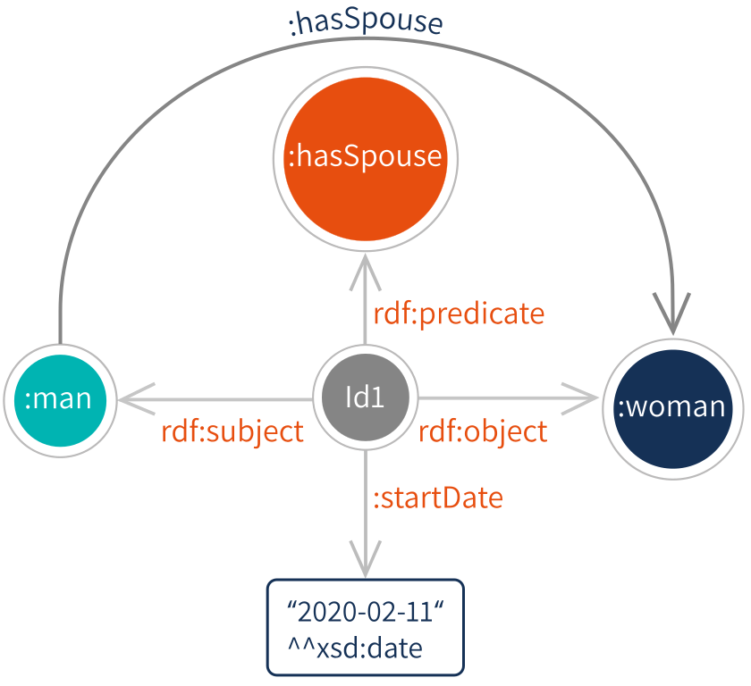

```bash
    :man :hasSpouse :woman .
    :id1 rdf:type rdf:Statement ;
      rdf:subject :man ;
      rdf:predicate :hasSpouse ;
      rdf:object :woman ;
      :startDate "2020-02-11"^^xsd:date .
```

Standard reification requires stating four additional triples to refer to the triple for which one wants to provide
metadata. The subject of these four additional triples has to be a new identifier (IRI or blank node), which later on
may be used for providing the metadata. The existence of a reference to a triple does not automatically assert it.

> **dvantage**: This approach is compliant with published RDF standards and will be supported by any RDF store.
>
> **Disadvantage**: This approach creates inefficiency related to exchanging or persisting the RDF data and the
> cumbersome syntax to access and match the corresponding four reification triples.

###### N-ary Relations

The approach for representing N-ary relations in RDF is to model it via a new relationship concept that connects all
arguments like:


```bash
    :Marriage1 rdf:type :Marriage ;
      :partner1 :man ;
      :partner2 :woman ;
      :startDate "2020-02-11"^^xsd:date .
```

> **Advantage**: Similar to standard reification in terms of standard compliance, but it adopts a schema specific to the
> domain model that is presumably understood by its consumers.
>
> **Disadvantage**: This approach increases the ontology model complexity and is proven difficult to evolve models in a
> backward compatible way.

###### Singleton Properties

Singleton properties are a hacky way to introduce statement identifiers as a part of the predicate like:

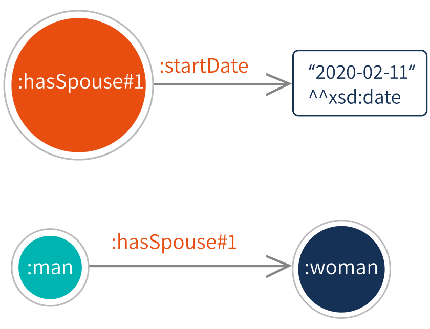

```bash
:man :hasSpouse#1 :woman .
:hasSpouse#1 :startDate "2020-02-11"^^xsd:date .
```

The local name of the predicate after the # encodes a unique identifier.

###### Named Graphs

The named graph approach is a variation of the singleton properties, which uses the so-called named graphs, which are
formally introduced in the SPARQL specification. Technically, this is a fourth element, which can be attached to the
`<subject, predicate, object>` triple, in order to designate that this statement is part of a specific named (sub)graph.
The identifier of the named graph can be treated as a node in the RDF graph, so that one can easily make statements
about the entire named graph. Singleton named graph can be created to allow one to attach properties to this statement
as follows:

```bash
:man :hasSpouse :woman :singletonGraph#1 .
:singletonGraph#1 :startDate "2020-02-11"^^xsd:date :metadata .
```

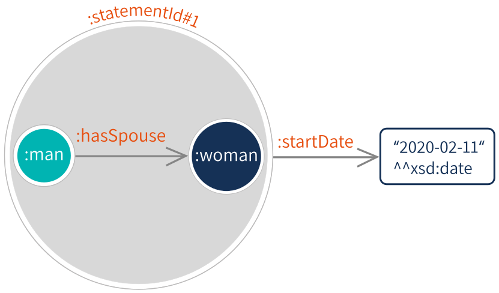

#### What RDF* Improves

RDF* is an extension of the RDF 1.1 standard that
[proposes a more efficient reification serialization syntax](https://arxiv.org/pdf/1406.3399.pdf). The main advantages
of this representation include reduced document size that increases the efficiency of data exchange as well as shorter
SPARQL queries for improved comprehensibility.

```bash
:man :hasSpouse :woman .
<<:man :hasSpouse :woman>> :startDate "2020-02-11"^^xsd:date .
```

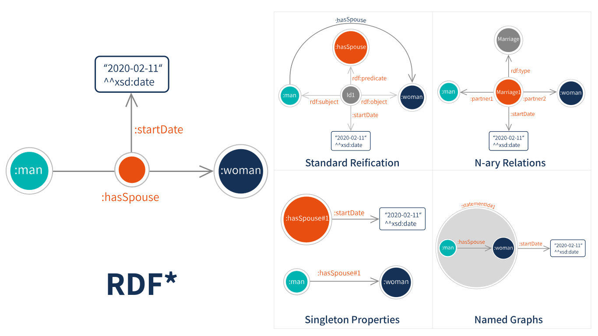

The RDF* extension captures the notion of an embedded triple by enclosing the referenced triple using the strings `<<`
and `>>`. The embedded triples, like the blank nodes, may take a subject and object position only, and their meaning is
aligned to the semantics of the standard reification, but using a much more efficient serialization syntax. To simplify
the querying of the embedded triples, the paper extends the query syntax with SPARQL* enabling queries like:

```bash
# List all metadata for the given reference to a statement
SELECT *
WHERE {
    <<:man :hasSpouse :woman>> ?p ?o
}
```

### What are Ontologies

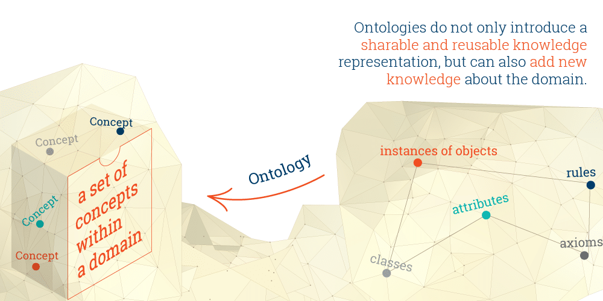

An ontology is a formal description of knowledge as a set of concepts within a domain and the relationships that hold
between them. To enable such a description, we need to formally specify components such as individuals (instances of
objects), classes, attributes and relations as well as restrictions, rules and axioms. As a result, ontologies do not
only introduce a sharable and reusable knowledge representation but can also add new knowledge about the domain.

The ontology data model can be applied to a set of individual facts to create a knowledge graph - a collection of
entities, where the types and the relationships between them are expressed by nodes and edges between these nodes, By
describing the structure of the knowledge in a domain, the ontology sets the stage for the knowledge graph to capture
the data in it.

There are, of course, other methods that use formal specifications for knowledge representation such as vocabularies,
taxonomies, thesauri, topic maps and logical models. However, unlike taxonomies or relational database schemas, for
example, ontologies express relationships and enable users to link multiple concepts to other concepts in a variety of
ways.

As one of the building blocks of Semantic Technology, ontologies are part of the W3C standards stack for the Semantic
Web. They provide users with the necessary structure to link one piece of information to other pieces of information on
the Web of Linked Data. Because they are used to specify common modeling representations of data from distributed and
heterogeneous systems and databases, ontologies enable database interoperability, cross-database search and smooth
knowledge management.

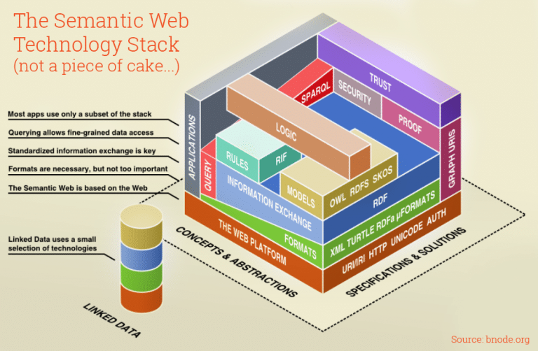

#### Ontologies for Better Data Management

Some of the major characteristics of ontologies are that they ensure a common understanding of information and that they
make explicit domain assumptions. As a result, the interconnectedness and interoperability of the model make it
invaluable for addressing the challenges of accessing and querying data in large organizations. Also, by improving
metadata and provenance, and thus allowing organizations to make better sense of their data, ontologies enhance data
quality.

#### The OWL Standard and Ontology Modelling

In recent years, there has been an uptake of expressing ontologies using ontology languages such as the Web Ontology
Language (OWL). OWL is a semantic web computational logic-based language, designed to represent rich and complex
knowledge about things and the relations between them. It also provides detailed, consistent and meaningful distinctions
between classes, properties and relationships.

By specifying both object classes and relationship properties as well as their hierarchical order, OWL enriches ontology
modeling in semantic graph databases. OWL, used together with an OWL reasoner in such enables consistency checks (to
find any logical inconsistencies) and ensures satisfiability checks (to find whether there are classes that cannot have
instances).

Also, OWL comes equipped with means for defining equivalence and difference between instances, classes and properties.
**These relationships help users match concepts even if various data sources describe these concepts somewhat
differently**. They also ensure the disambiguation between different instances that share the same names or
descriptions.

#### The Benefits of Using Ontologies

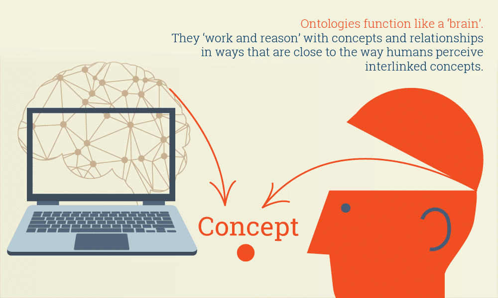

One of the main features of ontologies is that, by having the essential relationships between concepts built into them,
they enable automated reasoning about data. Such reasoning is easy to implement in semantic graph databases that use
ontologies as their semantic schemata.

What's more, ontologies function like a 'brain'. They 'work and reason' with concepts and relationships in ways that are
close to the way humans perceive interlinked concepts.

In addition to the reasoning feature, ontologies provide more coherent and easy navigation as users move from one
concept to another in the ontology structure.

Another valuable feature is that ontologies are easy to extend as relationships and concept matching are easy to add to
existing ontologies. As a result, this model evolves with the growth of data without impacting dependent processes and
systems if something goes wrong or needs to be changed.

Ontologies also provide the means to represent any data formats, including unstructured, semi-structured or structured
data, enabling smoother data integration, easier concept and text mining, and data-driven analytics.

#### Limitations of Ontologies

While ontologies provide a rich set of tools for modeling data, their usability comes with certain limitations.

One such limitation is the available property constructs. For example, while providing powerful class constructs, the
most recent version of the Web Ontology Language – OWL2 has a somewhat limited set of property constructs.

Another limitation comes from the way OWL employs constraints. They serve to specify how data should be structured and
prevent adding data inconsistent with these constraints. This, however, is not always beneficial. Often, data imported
from a new source into the RDF triplestore would be structurally inconsistent with the constraints set using OWL.
Consequently, this new data would have to be modified before being integrated with what is already loaded in the
triplestore.

A novel alternative to using ontologies to model data is using the Shapes Constraint Language (SHACL) for validating RDF
graphs against a set of constraints. A shape specifies metadata about a type of resource - how it is used, how it should
be used and how it must be used. As such, similarly to OWL, SHACL can be applied to validate data. Unlike OWL, however,
SHACL can be applied to validate data that is already available in the triplestore.

### What is Semantic Annotation

Semantic annotation is the process of tagging documents with relevant concepts (e.g., people, places, organizations,
products or topics). The documents are enriched with metadata: references that link the content to concepts, described
in a knowledge graph. This makes unstructured content easier to find, interpret and reuse.

The result of the semantic annotation process is metadata that describes the document via references to concepts and
entities mentioned in the text or relevant to it. These references link the content to the formal descriptions of these
concepts in a knowledge graph. Typically, such metadata is represented as a set of tags or annotations that enrich the
document, or specific fragments of it, with identifiers of concepts.

Semantic metadata can be stored in a knowledge graph, rather than embedded in a document. One modelling approach, which
enables a broad range of analytics, is to store the annotations as individual objects, which refer to the document,
which is also a node in the graph. This way documents and annotations become first class citizens of the knowledge graph
and can be indexed and queried alongside the other type of data there: ontologies, schemata, reference and master data.

#### Create Smart Content with Machine-Processable Marginalia

Think of semantic annotations as a sort of highly structured digital marginalia (notes made in the margins of a book or
other document), usually invisible in the human-readable part of the content. Written in the machine-interpretable
formal language of data, these notes serve computers to perform operations such as classifying, linking, inferencing,
searching, filtering, etc.

For instance, to semantically annotate chosen concepts in the sentence "Aristotle, the author of Politics, established
the Lyceum" means to identify Aristotle as a person and Politics as a written work of political philosophy, and to
further index, classify and interlink the identified concepts in a [semantic graph database](#what-is-an-rdf-triplestore),
also known as a triplestore. In this case, Aristotle can be linked to his date of birth, his teachers, his works, etc.
Politics can be linked to its subject, its date of creation, etc. Given the semantic metadata about the above sentence
and its links to other (external or internal) formal knowledge, algorithms will be able to automatically:

- find out who tutored Alexander the Great;
- answer which of Plato’s pupils established the Lyceum;
- retrieve a list of political thinkers who lived between 380 BC and 310 BC;
- render a list of Greek philosophers, which includes Aristotle.

#### How Does Semantic Annotation Work

Semantic annotation enriches content with machine-processable information by linking background information to extracted
concepts. These concepts, found in a document or another piece of content, are unambiguously defined and related to each
other within and outside the content. It turns the content into a better manageable data source.

A typical process of semantic enrichment includes:

##### Text Identification

> Step 1: Remove the boilerplate from the unstructured textual content.

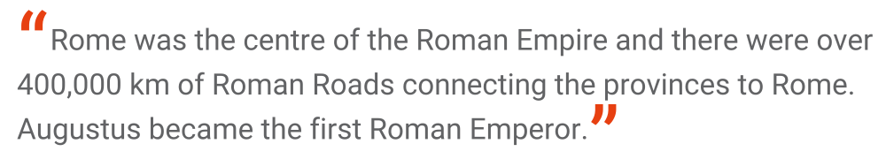

Text is extracted from non-textual sources such as PDF files, videos, documents, voice recordings, etc.

##### Text Analysis

> Perform a set of standard Natural Language Processing operations over content - such as Sentence Splitting,
> Part-of-Speech Tagging and Named Entity Recognition.

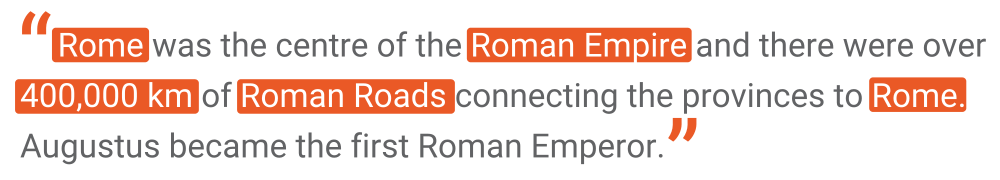

Algorithms split sentences and identify concepts such as people, things, places, events, numbers, etc.

##### Concept Extraction

> Classify and disambiguate the identified entities

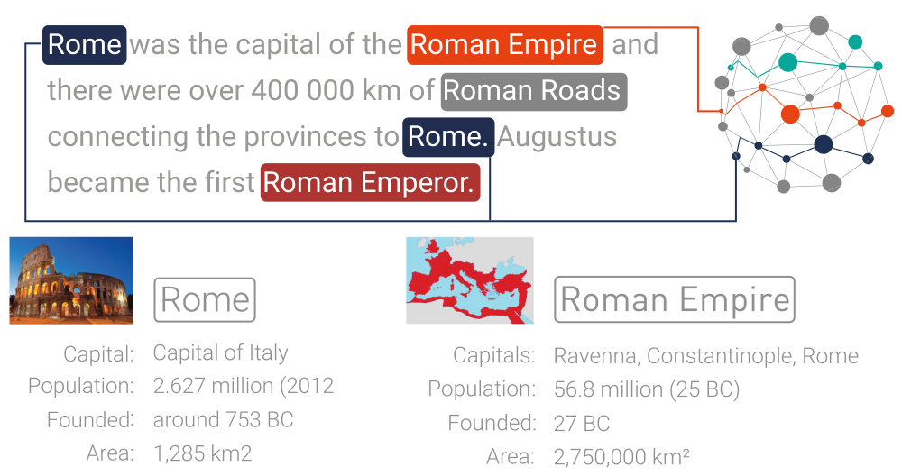

All recognized concepts are classified, which means that they are defined as people, organizations, numbers, etc. Next,
they are disambiguated, that is, they are unambiguously identified according to a domain-specific knowledge base. For
example, Rome is classified as a city and further disambiguated as Rome, Italy, and not Rome, Iowa.

This is the most important stage of semantic annotation. It recognizes text chunks and turns them into
machine-processable and understandable data pieces by linking them to the broader context of already existing data

##### Relationship Extraction

> Identify the relationships between known and newly recognized entities.

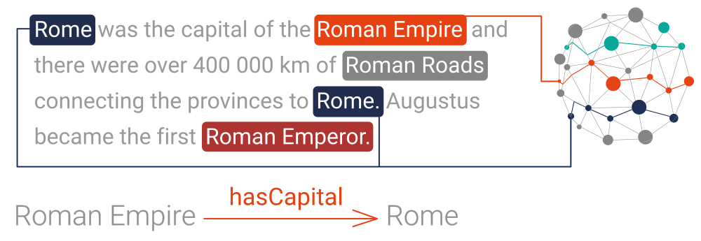

The relationships between the extracted concepts are identified and further interlinked with related external or
internal domain knowledge.

##### Indexing and Storing in a Semantic Graph Database

> The extracted knowledge, represented as a graph, is stored in a semantic graph database, which can also **create
> full-text indices in a search engine like Elasticsearch**.

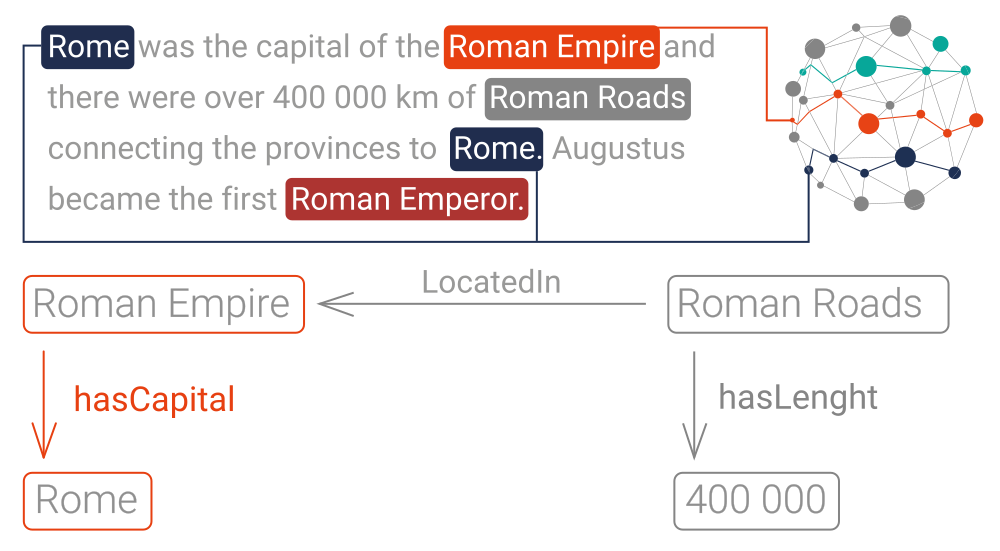

All mentions of people, things, etc. and the relationships between them that have been recognized and enriched with
machine-readable data are then indexed and stored in a semantic graph database for further reference and use.

#### Where is Semantic Annotation Used


What semantic annotation brings to the table are smart data pieces containing highly-structured and informative notes
for machines to refer to. Solutions that include semantic annotation are widely used for risk analysis, content
recommendation, content discovery, detecting regulatory compliance and much more.

### List of KG Products/Graph Databases

- [tiddlyroam](https://tiddlyroam.org/)
- [Memgraph](https://memgraph.com/)
- [GDB by rankings](https://db-engines.com/en/ranking/graph+dbms)

Good Books on Graph
-------------------

[Introduction to Graph Theory (Dover Books on Mathematics)](./Introduction to Graph Theory.epub)
